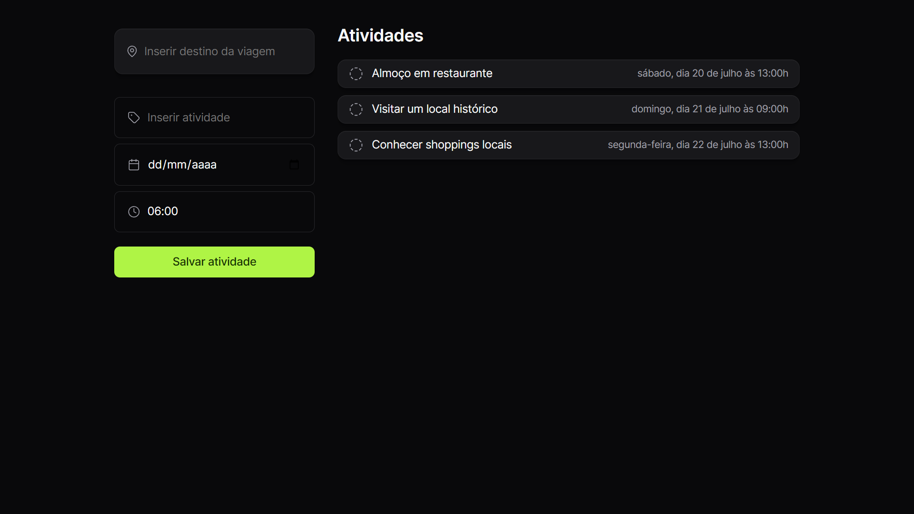
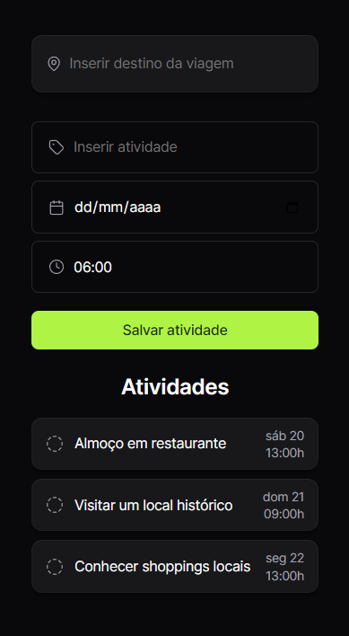

<div align="center">
  
  <h1>👨🏻‍🚀 <br> nlw-journey-fullstack</h1>
  <p>Um Planejador de Atividades para Viagens desenvolvido em HTML, CSS e JavaScript na NLW Journey da Rocketseat.</p>
</div>

## Table of Contents

- [About](#about)
- [Screenshot](#screenshot)
- [Key Features](#key-features)
- [Live Demo](#live-demo)
- [Built with](#built-with)
- [Contact](#contact)

## About <a id="about"></a>

O Plann.er é uma aplicação responsiva que permite adicionar e concluir eventos a serem realizadas durante uma viagem, adicione o seu destino e planeje o que fazer e em qual horário fazer cada atividade no seu próximo momento incrível.

## Screenshot <a id="screenshot"></a>

Desktop



Mobile



## Key Features <a id="key-features"></a>

- [x] Inserir destino
- [x] Inserir atividade
- [x] Inserir data da atividade
- [x] Inserir horário da atividade
- [x] Marcar atividade como concluída
- [x] Desmarcar atividade concluída

## Live Demo <a id="live-demo"></a>

Acesse o Plann.er no link abaixo

[Plann.er](https://udanielnogueira.github.io/nlw-journey-fullstack/)

<!-- ## The Process <a id="the-process"></a> -->

## Built with <a id="built-with"></a>

- JavaScript
- HTML
- CSS

## Highlights

Aqui estão alguns trechos de código que eu gostaria de destacar nesse projeto.

<br>

Uso da biblioteca Day.js para a formatação e exibição de datas.
```html
<script src="https://cdn.jsdelivr.net/npm/dayjs@1/dayjs.min.js"></script>
<script src="https://cdn.jsdelivr.net/npm/dayjs@1/locale/pt-br.js"></script>
<script>dayjs.locale('pt-br')</script>
```

<br>

Animação fade-in ao adicionar uma nova atividade.
```css
section .card-bg {
  animation: appear 1.5s;
}
  
@keyframes appear {
  from {
    opacity: 0;
  }
}
```

<br>

Efeito de sombra mais elaborado.
```css
.card-bg {
  border-radius: 12px;
  background: #18181B;
  
  box-shadow: 
  0px 8px 8px rgba(0, 0, 0, 0.1), 
  0px 4px 4px rgba(0, 0, 0, 0.1), 
  0px 2px 2px rgba(0, 0, 0, 0.1), 
  0px 0px 0px 1px rgba(0, 0, 0, 0.1), 
  inset 0px 0px 0px 1px rgba(255, 255, 255, 0.03), 
  inset 0px 1px 0px rgba(255, 255, 255, 0.03);
}
```

<br>

Atualizando lista de atividades.
```js
const atualizarListaDeAtividades = () => {
  const section = document.querySelector('section')
  section.innerHTML = ''

  if(atividades.length == 0) {
    section.innerHTML = `<p>Nenhuma atividade cadastrada</p>`
    return
  }

  for(let atividade of atividades) {
    section.innerHTML = section.innerHTML + criarItemDeAtividade(atividade)
  }
}
atualizarListaDeAtividades()
```

## Contact <a id="contact"></a>

LinkedIn [@udanielnogueira](https://www.linkedin.com/in/udanielnogueira/)
